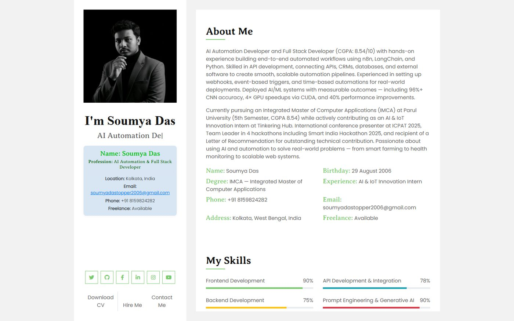

<center><h1>Soumya Das</h1></center>

Welcome to my personal portfolio! I'm **Soumya Das**, an AI Automation Developer & Full Stack Developer building end-to-end automated workflows and production web applications.

## 🚀 Features
- **Responsive Design**: Optimized for all devices
- **Modern Stack**: HTML5, CSS3, JavaScript, Bootstrap 4
- **Interactive UI**: Smooth animations, filterable project grid, lightbox previews
- **Contact Form**: Easily reach out via the integrated form

## 🔧 Technologies Used
- HTML5, CSS3, JavaScript
- Bootstrap 4
- jQuery, Owl Carousel, Isotope, Lightbox

## 📸 Screenshot



*Homepage showcasing my skills and projects*

## 🌐 Live Demo
Check out my live portfolio here: [soumya-das-2006.github.io/Soumya-Das-Portfolio](https://soumya-das-2006.github.io/Soumya-Das-Portfolio/)

## 📬 Contact Me
Reach out via email: [soumyadastopper2006@gmail.com](mailto:soumyadastopper2006@gmail.com)
Or use the contact form on my website.

## 📄 Resume
Download my latest resume: [Resume.pdf](https://drive.google.com/file/d/1MxyEw3xeFbMi2lMGW0iFk6D2tM7TdgfX/view?usp=sharing)

## 🛠️ Installation
Clone the repository:

```bash
git clone https://github.com/Soumya-Das-2006/Soumya-Das-Portfolio.git
cd Soumya-Das-Portfolio
```

Then open `index.html` in your browser, or serve it locally:

```bash
npx serve .
```
